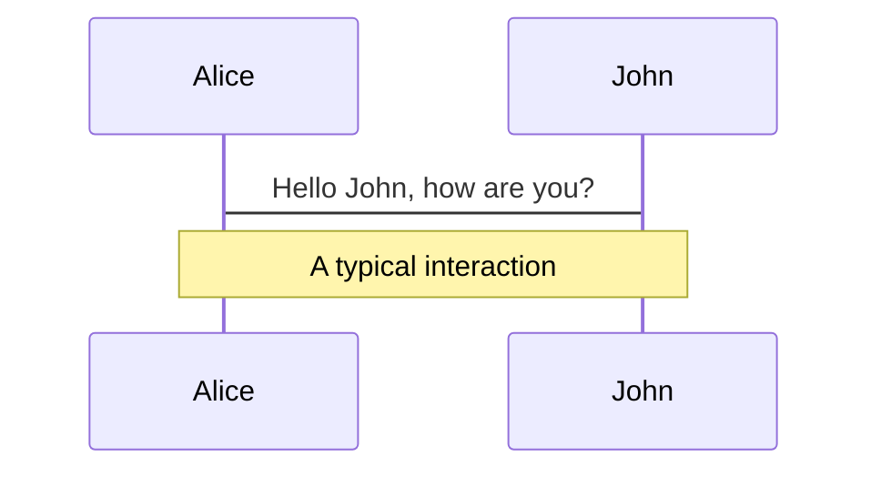
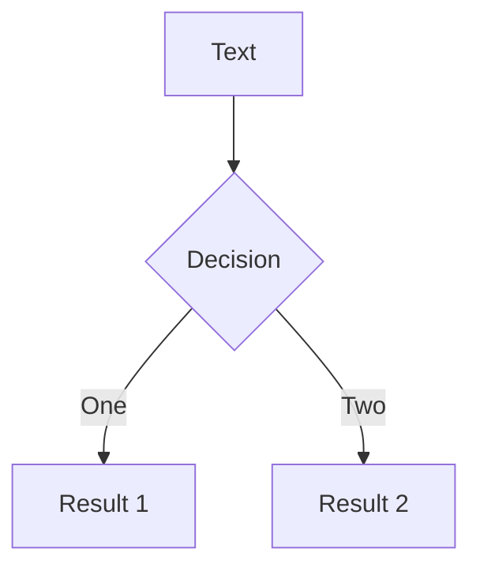
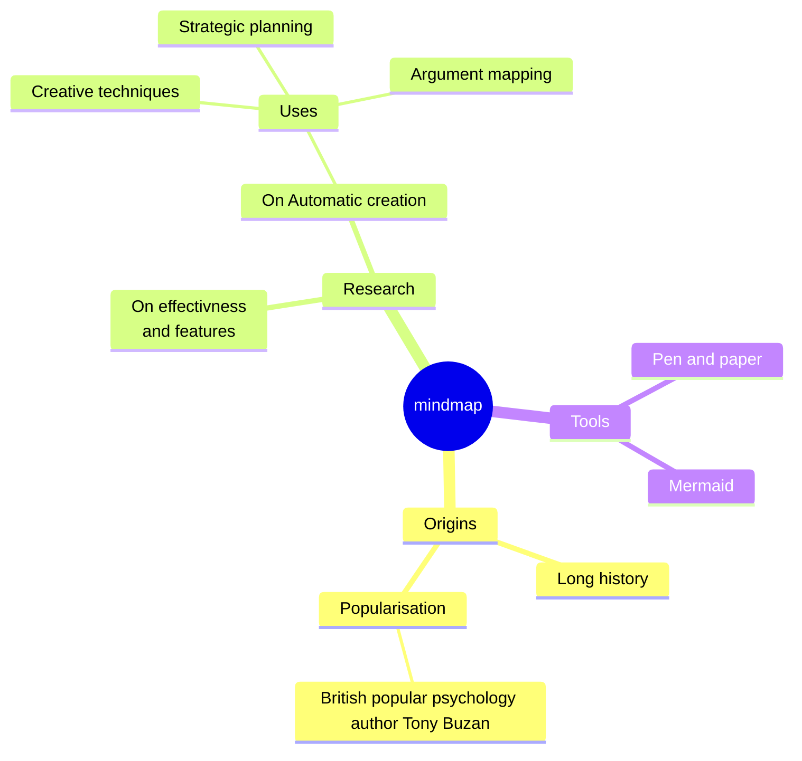
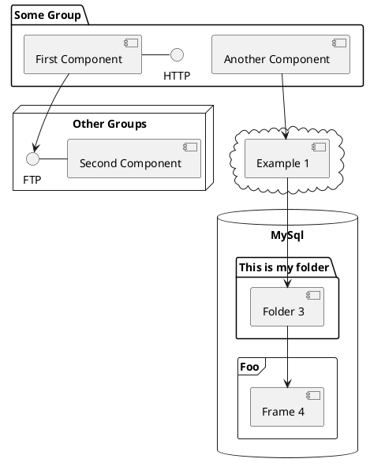

<h1 class="text-left !text-5xl p-2">
  From OS to Browser: Harnessing Web API Filesystem to Modern Application
</h1>

<div class="absolute bottom-10 flex flex-col">
  
  <span>GDSC UMS</span>
  <small>
  Oct 11th, 2023
  </small>
</div>

---
layout: two-cols
---

<div class="mt-8">
  <h1 class="!text-5xl !pt-8 font-bold">
    Kalwabed Rizki
  </h1>

  <p class="dark:c-gray-400 c-gray-500 !mb10">
    Organizer, JogjaJS
  </p>

- I work as a software engineer at VNT.
- I have a digital garden in <ph-github-logo class="c-gray-500" /> <a href="https://github.com/kalwabed">kalwabed</a>
- For some reason, I get used to putting my moments in <ph-instagram-logo class="c-gray-500" /> <a href="https://www.instagram.com/kalwabed">kalwabed</a>
- and short of my thoughts on <ph-twitter-logo class="c-gray-500" /> <a href="https://twitter.com/kalwabedrzk">kalwabedrzk</a>
    
</div>


::right::


---
layout: statement
---

# Today the browser is almost like an operating system

---
layout: center
class: text-2xl
---

<ul>
  <li>Multi-process architecture</li>
  <li>Extension and Web Apps</li>
  <li>Hardware access</li>
  <li>File system access</li>
  <li>Task management</li>
  <li>User account integration</li>
</ul>

---
layout: center
class: text-2xl
---

<ul>
  <li class="c-gray2">Multi-process architecture</li>
  <li class="c-gray2">Extension and Web Apps</li>
  <li class="c-gray2">Hardware access</li>
  <li class="c-blue">File system access</li>
  <li class="c-gray2">Task management</li>
  <li class="c-gray2">User account integration</li>
</ul>

---
layout: section
---

# File System Access
How do the operating system and browser manage this thing?

---
layout: center
---

# File System Access in the Operating System
Provides greater flexibility to users.

- File permissions
- Access control lists (ACLs)
- Security policies
- Logging and auditing
- Network file system

---
layout: statement
---

# What if we pull this system into the browser domain?

---
layout: center
---

It can be implemented, but currently with limitations (unfortunately):
1. Control
2. Isolation
3. Security
4. Permissions
5. Use cases

---
layout: section
---

# So What's Web Filesystem API?

---
layout: center
---

# Web Filesystem API
The term "Web API Filesystem" typically refers to the Filesystem Access API.

This API is a part of the broader web platform and allows web applications to interact with the user's local file system from within a web browser.

It provides a set of methods and features for reading, writing, creating, and deleting files and directories.

---
layout: statement
---

# What solution does the Web API Filesystem bring?

---
layout: center
---

# Web API Filesystem solutions
1. Access to local files
2. Offline web apps (PWA)
3. Data persistence
4. Document editing
5. Security

---
layout: statement
---

# What about browser support?
Of course, we also have to pay attention to browser support when talking about Web APIs.

---
layout: center
---


source: MDN

---
layout: center
---

`FileSystemWritableFileStream`


source: MDN

---
layout: center
---

# Web API Filesystem shortcomings
- Limited browser support
- Storage quotas
- Complexity
- Lack of native integration

---
layout: center
---

# Wrap Up
- File System Access in OS: OS manages files, permissions, and security.
- Extending to the Browser: Consider bringing OS-like file access to web applications.
- Web Filesystem API: A JavaScript API enabling file access within the browser.
- Solutions: Offline web apps, document editing, data persistence.
- Shortcomings: Limited browser support, storage quotas, complexity.
- Considerations: User transparency, privacy, and security are vital.

---
layout: end
---

Thank you!

Slides can be found on [kalwabed.xyz/talks](https://www.kalwabed.xyz/talks)

---
class: px-20
---

# Themes

Slidev comes with powerful theming support. Themes can provide styles, layouts, components, or even configurations for tools. Switching between themes by just **one edit** in your frontmatter:

<div grid="~ cols-2 gap-2" m="-t-2">

```yaml
---
theme: default
---
```

```yaml
---
theme: seriph
---
```


</div>

Read more about [How to use a theme](https://sli.dev/themes/use.html) and
check out the [Awesome Themes Gallery](https://sli.dev/themes/gallery.html).

---
preload: false
---

# Animations

Animations are powered by [@vueuse/motion](https://motion.vueuse.org/).

```html
<div
  v-motion
  :initial="{ x: -80 }"
  :enter="{ x: 0 }">
  Slidev
</div>
```

<div class="w-60 relative mt-6">
  <div class="relative w-40 h-40">
    
    
    
  </div>

  <div
    class="text-5xl absolute top-14 left-40 text-[#2B90B6] -z-1"
    v-motion
    :initial="{ x: -80, opacity: 0}"
    :enter="{ x: 0, opacity: 1, transition: { delay: 2000, duration: 1000 } }">
    Slidev
  </div>
</div>

<!-- vue script setup scripts can be directly used in markdown, and will only affects current page -->
<script setup lang="ts">
const final = {
  x: 0,
  y: 0,
  rotate: 0,
  scale: 1,
  transition: {
    type: 'spring',
    damping: 10,
    stiffness: 20,
    mass: 2
  }
}
</script>

<div
  v-motion
  :initial="{ x:35, y: 40, opacity: 0}"
  :enter="{ y: 0, opacity: 1, transition: { delay: 3500 } }">

[Learn More](https://sli.dev/guide/animations.html#motion)

</div>

---

# LaTeX

LaTeX is supported out-of-box powered by [KaTeX](https://katex.org/).

<br>

Inline $\sqrt{3x-1}+(1+x)^2$

Block
$$ {1|3|all}
\begin{array}{c}

\nabla \times \vec{\mathbf{B}} -\, \frac1c\, \frac{\partial\vec{\mathbf{E}}}{\partial t} &
= \frac{4\pi}{c}\vec{\mathbf{j}}    \nabla \cdot \vec{\mathbf{E}} & = 4 \pi \rho \\

\nabla \times \vec{\mathbf{E}}\, +\, \frac1c\, \frac{\partial\vec{\mathbf{B}}}{\partial t} & = \vec{\mathbf{0}} \\

\nabla \cdot \vec{\mathbf{B}} & = 0

\end{array}
$$

<br>

[Learn more](https://sli.dev/guide/syntax#latex)

---

# Diagrams

You can create diagrams / graphs from textual descriptions, directly in your Markdown.

<div class="grid grid-cols-4 gap-5 pt-4 -mb-6">









</div>

[Learn More](https://sli.dev/guide/syntax.html#diagrams)

---
src: ./pages/multiple-entries.md
hide: false
---

---
layout: center
class: text-center
---

# Learn More

[Documentations](https://sli.dev) · [GitHub](https://github.com/slidevjs/slidev) · [Showcases](https://sli.dev/showcases.html)
